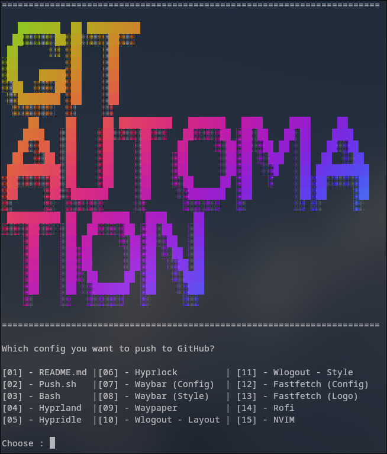

# GIT AUTOMATION

[](https://choosealicense.com/licenses/mit/) 

Simple bash script for automating git proccess of add files, commit with comment, and push to GitHub.
This will help specially if you manage and organize multiple files, like your dotfiles.



# Prerequisites

This is optional, for get those beautiful banner, you need :

- [Figlet](http://www.figlet.org/) for the stylize text.
- [Lolcat](https://github.com/busyloop/lolcat) for the rainbow effect.

If you feel's like don't need those (really?), you can commenting these lines :

```bash
xxx
```

# Installation

1. Clone this repo to your local machine

```
git clone https://github.com/mrheriyansyah/git-automation.git
cd git-automation
```
2. Copy or move the script into your project's directoy

```
cp git-automation.sh ~/path/to/your/project/
```
3. Make it executable
```
chmode x+ git-automation.sh
```

# Usage

1. Run the script with `sh push.sh`.
2. Choose by typing the number of file you want to commit that shows on the menu.
3. Type the commit message for that file.
4. Choose [y]es if you want to add more files, it will shows the menu options again. Or choose [n]o if you want to process the push.
5. Input the ssh key if required.
6. Your files should be updated on GitHub.

# Customization

The default script comes with my personal setup. You need to change file's path that match with the number on the menu on this section to make it suitable for your needs :

``` bash
if [ $CHOOSE == 1 ]; then
		git add path/to/your/file1
	elif [ $CHOOSE == 2 ]; then
		git add path/to/your/file2
	elif [ $CHOOSE == 3 ]; then
		git add path/to/your/file3
	else
		echo "That's not an option!"
        # Restore added files
        git restore --staged .
		exit 1
	fi
```
